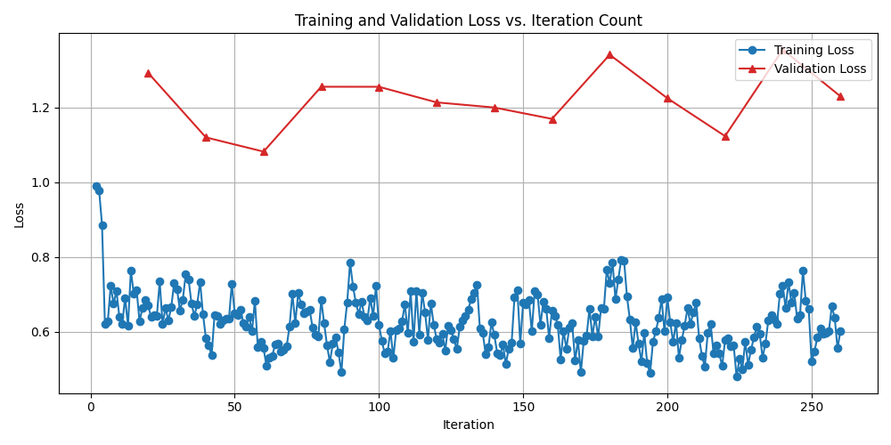
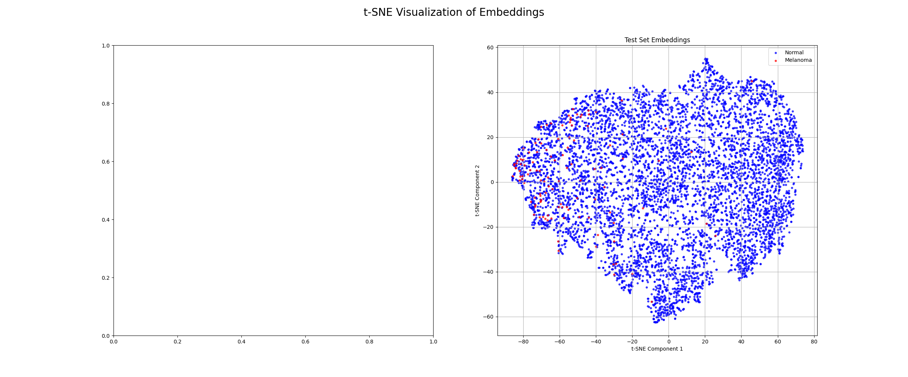

Here is a comprehensive `README.md` file tailored to your specific codebase, using the provided template as a structural guide.

---

# Classifier for ISIC 2020 Kaggle Challenge based on a Two-Stage Siamese Network <!-- omit from toc -->

**Table of Contents**
- [Model and Problem Description](#model-and-problem-description)
- [Model Architecture](#model-architecture)
- [Dependencies and Reproducibility](#dependencies-and-reproducibility)
- [Model Usage](#model-usage)
- [Results](#results)
- [Training Details](#training-details)
- [References](#references)

## Model and Problem Description
A siamese network is a neural network architecture that learns to map high-dimensional inputs, like images, into a lower-dimensional embedding space. The key objective is to structure this space such that similar inputs are mapped to nearby points, while dissimilar inputs are mapped to distant points. This project applies this concept to the ISIC 2020 Melanoma Classification Challenge dataset [2] though it uses a 224x224 resized version[3], which involves identifying malignant melanoma in images of skin lesions.

This project uses a siamese network to learn a feature representations for skin lesions. During inference, a query image is mapped to a location in feature space, by finding the distance between this point and a known embedding. 

## Model Architecture
The architecture is a siamese network that is trained in three stages, the trunk and embedder are trained on semihard then hard triplets afterwhich the classifier is trained. 

1.  **Trunk & Embedder:** The trunk is a ResNet50 model[4] pre-trained on ImageNet, which acts as the feature extractor. The final classification layer of the ResNet is removed, and its output is fed into the `embedder`. This `embedder` further processes the features and projects them into the final embedding space. L2 normalization is applied to the outputs to ensure the embeddings lie on a unit hypersphere[5]. A problem with triplet loss is it goes to zero once the triplet is position correctly. This means as the model trains many triplets in a batch are useless for training the model. This can be solved by using triplet mining to get difficult triplets which the model can learn from.

2.  **Two-Stage Training:**
    *   **Stage 1: Embedder Training with Triplet Loss and semi-hard triplet mining.** The `trunk` and `embedder` are trained together using a **Triplet Margin Loss**. For each training sample (an "anchor"), we select a "positive" sample from the same class and a "negative" sample from a different class. Triplet Loss aims to minimize the distance between the anchor and positive embeddings while maximizing the distance between the anchor and negative embeddings by at least a certain margin. Semi-hard mining selects triplets where negative is further from the anchor than the positive.

    *   **Stage 2: Embedder Training with Triplet Loss and hard triplet mining.** Same as the previous step except using hard mining. Hard mining selects triplets where negative is closer to the anchor than the positive.

3. **Classifier** The classifier is a MLP which is trained using Binary Cross-Entropy Loss to give the similarity between two images. It is trained on pairs of images where 50% of pairs are the same class and 50% are from different classes. The class of a pair is equally weighted between maligant and benign.

## Dependencies and Reproducibility

Seeding is used in `train.py` to ensure reproducibility for data splitting and model weight initialization.

## Model Usage

**1. Data Setup**
First, download the ISIC 2020 dataset. You can use the provided utility script for this:
```bash
python utils.py
```
This will download the data into a `./data/` directory. The project expects the following structure:
- Image files in `./data/train-image/image/`
- Metadata in `./data/train-metadata.csv`

**2. Training the Model**
Training is initiated through train.py. Hyperparameters such as learning rates, batch size, and epochs can be configured at the top of the file.
```bash
python train.py
```
The script will:
1.  Initialize the `DatasetController` to split the data into training, validation, and test sets.
2.  Train the embedder with semi-hard and hard triplet mining ,saving the model to `siamese_best.pth`.
3.  Train the classifier with the embedder's weights frozen ,saving the model to `siamese_best.pth`.
4.  Finally, it runs `evaluate_on_test_set` to report performance metrics on the test data.

**3. Evaluation and Prediction**
The `evaluate_on_test_set` function in `train.py` handles the final evaluation. It performs few-shot classification by:
1.  Creating a support set of `SUPPORT_SET_SIZE` known melanoma and normal images.
2.  Computing feature embeddings for this support set and for the entire test set.
3.  For each test image, it calculates similarity scores against all images in the support set using the trained classifier head.
4.  The final prediction is based on the average similarity to the melanoma class versus the normal class.

The `predict.py` script provides the core logic for this process and can be adapted for inference on new, unseen images.

## Results

Running the training and evaluation script will produce several outputs, allowing for a comprehensive analysis of the model's performance.

**Training and Validation Loss**
Loss curves for both the embedder and classifier training stages are generated and saved as `.png` files. These plots help visualize the training progress and identify potential overfitting.

*Embedder Training Loss *
:-------------------------:|
 

**Classification Performance**
The evaluation on the test set will print a detailed classification report and generate a confusion matrix. Due to the class imbalance in the ISIC dataset (far more benign than malignant cases), metrics like recall, F1-score, and the ROC AUC are more informative than accuracy.

*Confusion Matrix (placeholder)*


A summary of the model's performance on the test set would be tabulated as follows:

| Metric             | Normal (0) | Melanoma (1) | Macro Avg | Weighted Avg |
| ------------------ | ---------- | ------------ | --------- | ------------ |
| Precision          | 1.00       | 0.09         | 0.54      | 0.98         |
| Recall             | 0.86       | 0.76         | 0.81      | 0.86         |
| F1-score           | 0.92       | 0.16         | 0.54      | 0.91         |
| **ROC AUC Score:** | \multicolumn{4}{c|}{0.XX}                             |

**Embedding Visualization**
The `generate_and_plot_tsne` function in `utils.py` can be used to visualize the learned embedding space.

*t-SNE of Test Set Embeddings*


## Training Details

-   **Data Augmentation:** This includes random flips, rotations, color jitter, scaling, translation, and the addition of Gaussian noise.
-   **Triplet Mining:** The training process uses the `pytorch-metric-learning` library to mine triplets. It starts with a "semi-hard" mining strategy until the validation loss doesn't improve then repeats the process with hard mining
-   **Optimization:** The Adam optimizer is used. Different learning rates are applied to the `trunk`, the `embedder`, and the `classifier` to account for their different levels of complexity and training. A `ReduceLROnPlateau` learning rate scheduler is also used to adjust the learning rate based on validation loss.

## References

-  [1] G. Koch, R. Zemel, R. Salakhutdinov et al., “Siamese neural networks for one-shot image recognition,” in
 ICML deep learning workshop, vol. 2. Lille, 2015, p. 0.
- [2]: ISIC 2020 Melanoma Classification Challenge(https://www.kaggle.com/c/siim-isic-melanoma-classification/overview).
- [3]: ISIC 2020 Melanoma Classification Challenge - Resized(https://www.kaggle.com/datasets/nischaydnk/isic-2020-jpg-224x224-resized)
- [4]: He, K.; Zhang, X.; Ren, S.; Sun, J. (2015). Deep Residual Learning for Image Recognition.